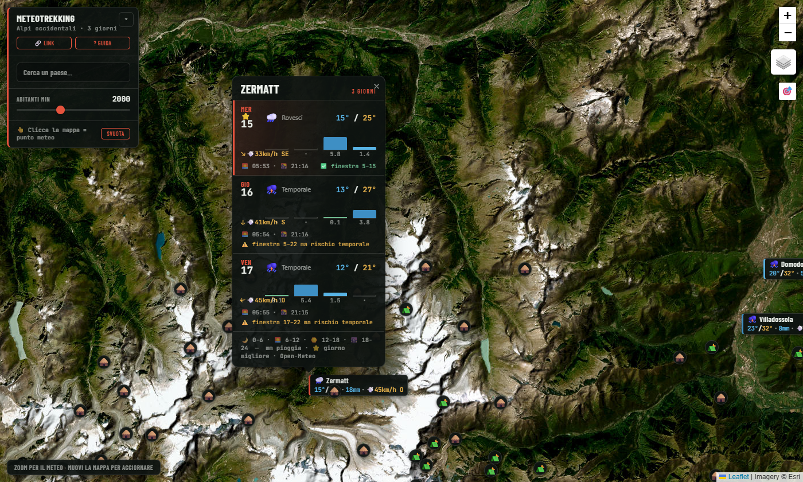

# 🏔️ MeteoTrekking

**Il meteo per chi va in montagna, direttamente sulla mappa.**

Previsioni a 3 giorni sulle Alpi occidentali per pianificare escursioni: pioggia per fasce orarie, finestra all'asciutto nelle ore di luce, giorno migliore per uscire, raffiche di vento, rifugi, bivacchi e sentieri. Un solo file HTML: si apre col doppio clic, senza installazioni, senza account, senza API key.



## ✨ Funzioni

### Meteo pensato per il trekking
- **Etichette sulla mappa** per ~4.200 comuni: temperature min/max, pioggia totale 3 giorni, raffica massima con direzione. Il bordo colorato dice a colpo d'occhio quanta pioggia arriva (verde = asciutto → rosso = molta).
- **Scheda 3 giorni** con la domanda giusta: *quando posso uscire?*
  - barre pioggia per fasce orarie (🌙 notte · 🌅 mattina · ☀️ pomeriggio · 🌆 sera)
  - **finestra all'asciutto** calcolata sulle ore di luce ("✅ finestra 9–15")
  - **⭐ giorno migliore** dei tre — mai assegnato a un giorno di temporale
  - **⚠️ rischio temporale**: se è previsto un temporale, la finestra asciutta non viene spacciata per una promessa
  - alba/tramonto, vento con freccia di direzione
- **Radar pioggia live** (RainViewer): dove sta piovendo adesso.

### Montagna vera
- **549 rifugi e bivacchi** (OSM) con quota: un clic e hai il meteo *in quota*, non quello del fondovalle.
- **778 rotte principali cliccabili** — Alte Vie, GTA, GR, tour: nome, numero, lunghezza, difficoltà SAC. Più tutti i sentieri segnati come sfondo (Waymarked Trails).
- **Punti tuoi**: clicchi un punto qualsiasi (un colle, un lago, un bivacco non mappato) e il suo meteo resta sulla mappa, anche alla prossima visita.

### Comoda
- Ricerca località con volo sulla mappa, filtro per dimensione dei paesi (dalle città a ogni frazione di valle), geolocalizzazione 🎯, link condivisibile della vista, guida integrata, ottimizzata per mobile.

## 🚀 Uso

**Basta aprire [`index.html`](index.html) in un browser.** Serve solo la connessione per mappa e meteo.

Oppure servilo come sito statico (Vercel, GitHub Pages, un qualsiasi web server): nessuna build, nessuna dipendenza.

## 🤖 Server MCP

Il repo include un server [MCP](https://modelcontextprotocol.io) che espone gli stessi dati a **qualunque assistente AI** (Claude Code, Claude Desktop, Cursor, Windsurf, VS Code, Cline…): chiedi *"che meteo fa ad Alagna nel weekend?"* e l'agente risponde con dati veri.

```bash
cd mcp && npm install     # richiede Node 18+
```

| Tool | Cosa fa |
|---|---|
| `previsioni` | Meteo trekking 1–7 giorni per comune, rifugio o coordinate: finestra asciutta, giorno migliore, rischio temporale, fasce pioggia |
| `cerca_localita` | Cerca comuni, rifugi e bivacchi per nome |
| `rifugi_vicini` | Rifugi entro un raggio, ordinati per distanza, con quota |
| `sentieri` | Rotte principali per nome o vicinanza a una località |

**Claude Code**: già registrato dal file [`.mcp.json`](.mcp.json) — apri Claude Code nella cartella del repo e approva il server.

**Altri client** (es. Claude Desktop): aggiungi alla configurazione MCP:

```json
{
  "mcpServers": {
    "meteotrekking": {
      "command": "node",
      "args": ["/percorso/assoluto/MeteoTrekking/mcp/server.mjs"]
    }
  }
}
```

Il server legge comuni, rifugi e rotte direttamente da `index.html` (fonte unica) e interroga Open-Meteo live. Trasporto stdio: gira in locale, nessun dato tuo esce dalla macchina.

## 🗺️ Copertura e dati

**Piemonte, Valle d'Aosta, Liguria** e le Alpi francesi e svizzere limitrofe (bbox 43.3–46.6 N, 5.5–9.7 E). Comuni, rifugi e rotte sono incorporati nel file — estratti una volta, zero API a runtime oltre al meteo.

| Dato | Fonte | Licenza/note |
|---|---|---|
| Previsioni | [Open-Meteo](https://open-meteo.com) | gratis, multi-modello (ICON/ECMWF), no key |
| Radar pioggia | [RainViewer](https://www.rainviewer.com) | gratis, no key |
| Comuni | [GeoNames](https://www.geonames.org) cities500 | CC-BY |
| Rifugi, bivacchi, rotte | [OpenStreetMap](https://www.openstreetmap.org) | ODbL |
| Sentieri (tiles) | [Waymarked Trails](https://waymarkedtrails.org) | — |
| Mappa | Esri World Imagery · [OpenTopoMap](https://opentopomap.org) | — |

## ⚠️ Nota di prudenza

Le previsioni sono un aiuto alla pianificazione, non un sostituto del buon senso: in montagna il tempo cambia in fretta e i modelli sbagliano proprio dove serve più precisione. Consulta sempre i bollettini ufficiali (Arpa, Météo-France, MeteoSvizzera) prima di partire.
